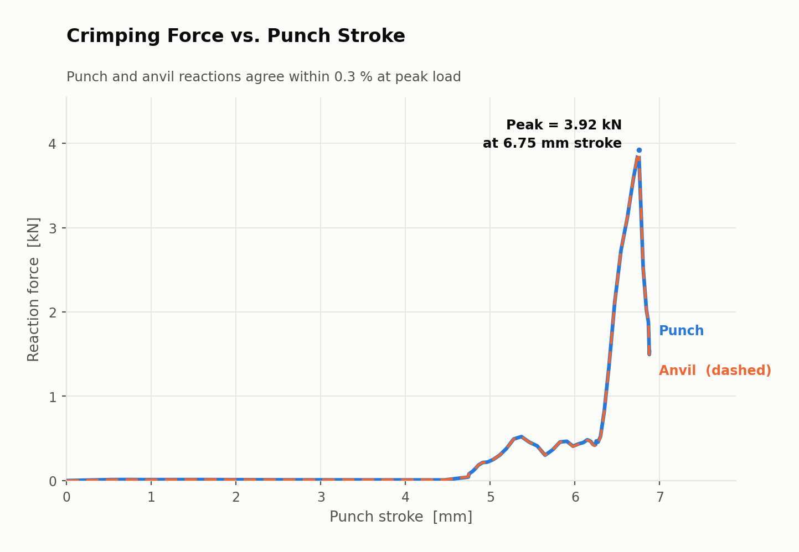
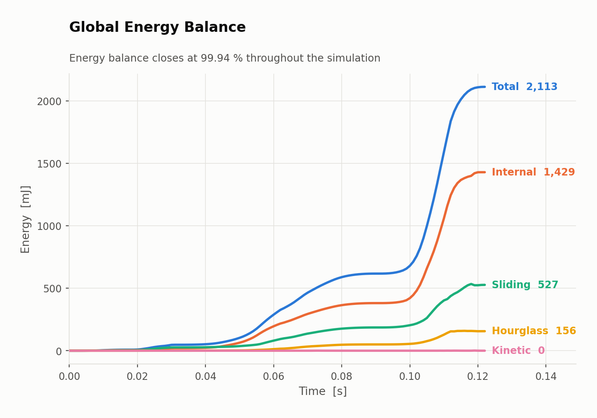
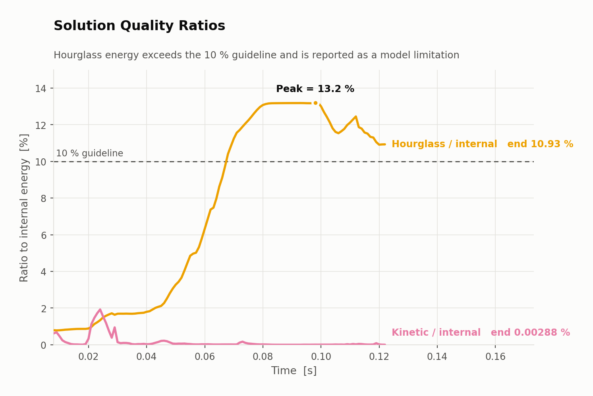
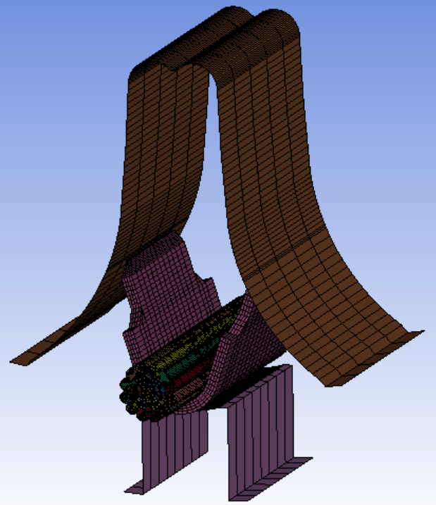
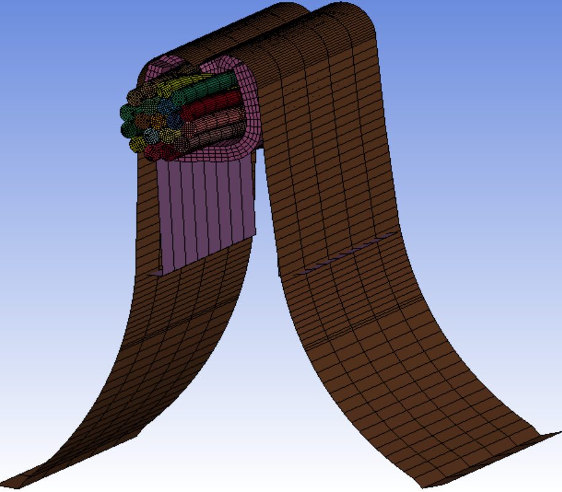

# Wire Crimp Forming Simulation — LS-DYNA Explicit

Crimp forming of a 19-strand copper conductor into a copper-alloy ferrule,
solved as an explicit quasi-static forming analysis using LS-DYNA SMP R16.1.

The model investigates nonlinear large-deformation forming, plasticity,
frictional contact and solution-quality control during the crimping process.

**Peak crimping force: 3.92 kN**

Punch and anvil reactions agree within **0.33 % at peak load**.
The final global energy balance closes within **0.06 %**.

All reported numerical results are derived from the raw LS-DYNA output
committed in [`results/`](results/).

📄 **[Detailed analysis →](docs/analysis.md)**

---

## Quick Start

The final LS-DYNA keyword deck is located at `model/crimp_forming.k`.

```text
lsdyna i=model/crimp_forming.k ncpu=4 memory=34m
```

The exact solver settings used for the reported results are documented below.

---

## Results

### Crimping Force



The punch initially closes the gap with negligible reaction force.
Significant loading begins after approximately 4.5 mm of punch stroke.

The reaction force then increases as the ferrule arms bend inward.
A local change in the deformation response occurs as the arms fold and
compact around the conductor. The force subsequently rises steeply as the
strands become increasingly confined by the ferrule and tooling.

The peak reaction force is approximately 3.92 kN at 6.75 mm punch stroke.

The punch and anvil reaction histories lie almost on top of each other,
providing a global equilibrium check for the model.

### Global Energy Balance



The global energy balance remains close throughout the simulation.

At termination:

| Energy component | Value |
|---|---|
| Internal energy | 1429.2 mJ |
| Sliding interface energy | 527.2 mJ |
| Hourglass energy | 156.2 mJ |
| Kinetic energy | 0.04 mJ |
| **Total energy** | **2112.6 mJ** |
| External work | 2113.8 mJ |

The resulting energy ratio is approximately 0.99943, corresponding to a
difference of about 0.06 % from the external work.

The kinetic energy remains small relative to the internal energy, supporting
the use of the explicit solution as a quasi-static forming analysis.

### Solution Quality



The kinetic-to-internal-energy ratio remains low, with a final value of
approximately 0.003 % and a maximum of 1.92 %.

The hourglass-to-internal-energy ratio reaches a peak of approximately
13.2 % and finishes at 10.9 %.

The hourglass level therefore exceeds the commonly used 10 % guideline and
is treated as a limitation of the current model. The result is explicitly
reported rather than hidden or removed from the analysis.

---

## Key Results

| Quantity | Result |
|---|---|
| Peak crimping force | 3.92 kN |
| Peak force location | 6.75 mm punch stroke |
| Punch / anvil force difference at peak | 0.33 % |
| Punch / anvil force difference at final state | 0.06 % |
| Final total energy | 2112.6 mJ |
| External work | 2113.8 mJ |
| Energy ratio | 0.99943 |
| Kinetic / internal energy, final | 0.003 % |
| Kinetic / internal energy, maximum | 1.92 % |
| Hourglass / internal energy, final | 10.9 % |
| Hourglass / internal energy, maximum | 13.2 % |
| Simulation cycles | 453,086 |
| Runtime | 6 h 48 min |
| CPU configuration | 4 SMP threads |
| Termination | Normal |

---

## Model

| Parameter | Configuration |
|---|---|
| Solver | LS-DYNA SMP R16.1, double precision |
| CPU | 4 SMP threads |
| Unit system | mm – tonne – s |
| Force unit | N |
| Stress unit | MPa |
| Energy unit | mJ |
| Nodes | 85,405 |
| Solid elements | 67,375 |
| Solid formulation | ELFORM 1 |
| Rigid shell elements | 1,452 |
| Deformable parts | 19 copper strands + 1 ferrule |
| Rigid parts | Punch + anvil |
| Strand diameter | 0.286 mm |
| Ferrule dimensions | 3.30 × 3.25 × 5.44 mm |
| Ferrule wall | 0.245 mm |
| Ferrule wall discretisation | 4 elements |
| Material model | `*MAT_PIECEWISE_LINEAR_PLASTICITY` (MAT_024) |
| Plasticity | Tabulated flow curves via `LCSS` |
| Punch stroke | 6.88 mm |
| Forming time | 0.122333 s |
| Loading | Prescribed displacement |
| Loading profile | Smooth-step, 4 phases |
| Mass scaling | `DT2MS = −3.0e-7` |
| Resulting timestep | approximately 2.7e-7 s |
| Time integration | Explicit |
| Contact interfaces | 5 |
| Contact formulation | Segment-based penalty |
| Contact parameter | `SOFT = 1` |
| Friction coefficient | µ = 0.15 – 0.30 |

**Model setup and final configuration**





---

## Deformation Behaviour

The simulation captures the progressive forming of the ferrule around the
19-strand conductor.

The main deformation stages are:

1. **Tool approach** — the punch closes the initial gap with negligible
   reaction force.
2. **Ferrule bending** — the ferrule arms begin to fold inward.
3. **Strand compaction** — the conductor strands become increasingly confined
   by the ferrule and tooling.
4. **Final compression** — the force rises sharply as the available space
   inside the ferrule decreases.

The final configuration shows the ferrule arms folded around the conductor
and the individual strands significantly compacted within the cavity.

The deformation is dominated by large plastic deformation and contact
interactions between the strands, ferrule and tooling.

---

## Solution Quality and Limitations

### Hourglass Energy

The hourglass energy reaches approximately 13.2 % of internal energy
and remains at approximately 10.9 % at the end of the simulation.

This exceeds the commonly used 10 % guideline.

Approximately 83 % of the hourglass energy is associated with the ferrule,
where the deformation contains tight folding regions.

Therefore, the hourglass behaviour is reported as a model limitation.
Global force equilibrium and the global energy balance remain satisfactory,
but local quantities in regions strongly affected by hourglass deformation
should not be interpreted as quantitatively validated physical predictions.

### Mass Scaling

Mass scaling is used to make the explicit simulation computationally
tractable.

The scaled mass reaches approximately 265 times the physical mass (1.241 g).

This is aggressive and limits the physical interpretation of inertial
quantities.

The use of mass scaling is therefore justified only for the intended
quasi-static forming assessment, supported by the low kinetic-to-internal
energy ratio.

No inertia-driven quantity from this model should be interpreted as a
validated physical result.

### Contact Penetration

Local contact penetration is present at the punch/ferrule interface in the
final states.

The punch and anvil reactions remain in close agreement and the punch force
remains compressive throughout the forming process.

Therefore, the global force and energy results are retained for the present
study, while local contact pressure results at the affected interface are
not reported as validated quantities.

### Contact Stability

The initialisation output indicates a considerably smaller recommended
contact timestep than the timestep used during the mass-scaled simulation.

The simulation therefore relies on the intended mass-scaled quasi-static
approach rather than attempting to reproduce the unscaled stable timestep.

The solution was checked a posteriori using:

- kinetic-to-internal energy ratio,
- sliding-interface energy,
- force-history behaviour,
- absence of obvious contact-induced oscillations.

This does not eliminate the limitation, but it documents the numerical
assumption used for the present study.

### No Springback Simulation

The current analysis ends at the final forming position.

No subsequent tool-release or springback step is included.

Consequently, the model does not provide a validated prediction of the
unloaded final crimp height.

### No Experimental Validation

No experimental measurements are available for direct validation of the
present LS-DYNA model.

In particular, the model has not been validated against:

- measured crimp height,
- pull-out force,
- cross-sectional geometry,
- metallographic deformation,
- measured forming force.

The results should therefore be interpreted as a numerical investigation
rather than a validated prediction of the physical crimping process.

### SMP Reproducibility

The simulation was performed using the LS-DYNA SMP solver.

The results are not guaranteed to be bit-reproducible between different
parallel execution conditions.

Two runs of the same deck produced peak forces approximately 0.9 % apart.

The present results should therefore be interpreted within the numerical
repeatability observed for the chosen solver configuration.

---

## Repository Structure

```text
LS-DYNA-Crimping-Simulation/
│
├── README.md
├── LICENSE
│
├── model/
│   └── crimp_forming.k
│
├── results/
│   ├── glstat
│   ├── matsum
│   ├── rcforc
│   ├── sleout
│   ├── lsrun.out.txt
│   │
│   ├── figures/
│   │   ├── 01_crimping_force_vs_stroke.png
│   │   ├── 02_global_energy_balance.png
│   │   └── 03_solution_quality_ratios.png
│   │
│   ├── screenshots/
│   └── animations/
│
├── scripts/
│   └── plot_results.py
│
└── docs/
    └── analysis.md
```

### Important files

| Path | Description |
|---|---|
| `model/crimp_forming.k` | Final LS-DYNA solver deck used for the simulation |
| `results/` | Raw LS-DYNA solver output |
| `results/figures/` | Generated result figures |
| `scripts/plot_results.py` | Python script used to regenerate the figures |
| `docs/analysis.md` | Detailed analysis, modelling decisions and interpretation |

The figures are generated from the raw result files rather than being
manually edited.

---

## Reproducibility

The main result figures can be regenerated from the committed LS-DYNA
output using:

```bash
python scripts/plot_results.py
```

The numerical values presented in the README and analysis are derived from
the committed solver results.

The repository therefore contains both the solver model and the numerical
output required to inspect the reported results.

---

## Reference

The model was developed as an independent LS-DYNA reproduction of the
forming problem described in the following Abaqus/Explicit example:

> Dassault Systèmes, *Abaqus Example Problems Guide*, Section 2.1.10,
> "Crimp forming with general contact", Abaqus/Explicit, 2016.

The published Abaqus/Explicit example was used as a technical reference for
the model geometry, material information and forming process.

The present work was rebuilt independently in LS-DYNA. It does not claim
solver-to-solver numerical equivalence with Abaqus.

The purpose of the reproduction is to investigate the same type of nonlinear
wire-crimping problem using LS-DYNA, with particular focus on:

- large-deformation plastic forming,
- frictional contact,
- strand-to-strand interaction,
- explicit quasi-static solution control,
- energy balance,
- force equilibrium,
- hourglass control,
- numerical limitations.

Full references, including the original publications cited by the Abaqus
example, are listed in [`docs/analysis.md`](docs/analysis.md#references).

---

## Disclaimer

This is educational, self-directed engineering work without experimental
validation.

The results should not be interpreted as a validated prediction of the
physical crimping process.

The reported limitations, including hourglass energy, aggressive mass
scaling, contact penetration, lack of springback and absence of experimental
validation, should be considered when interpreting the results.
