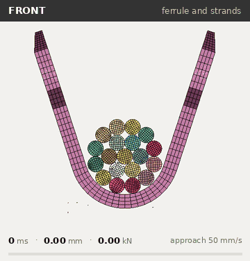
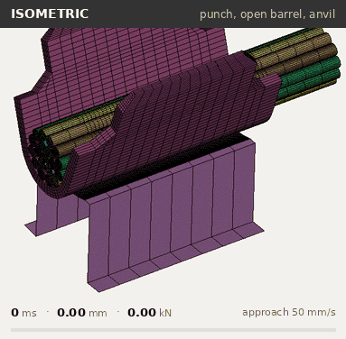
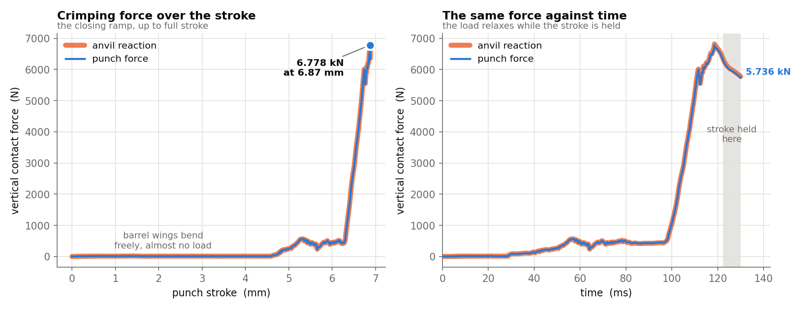
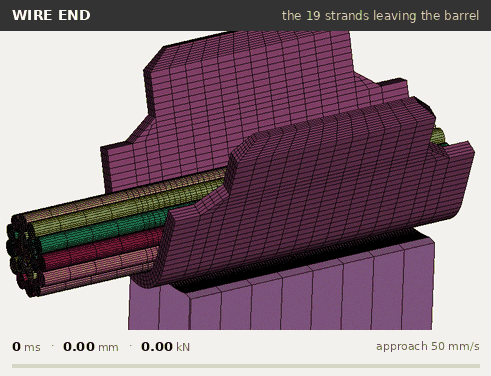
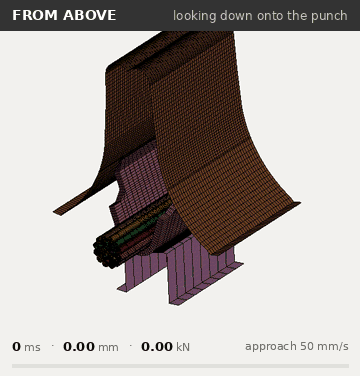
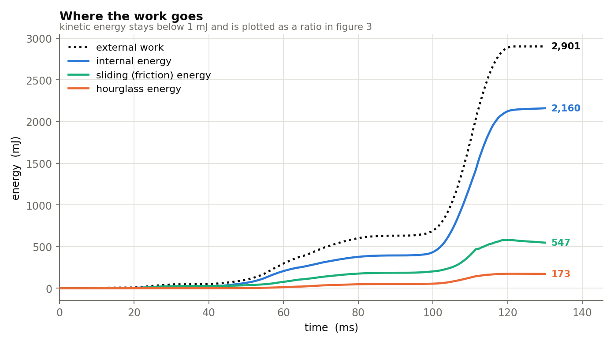
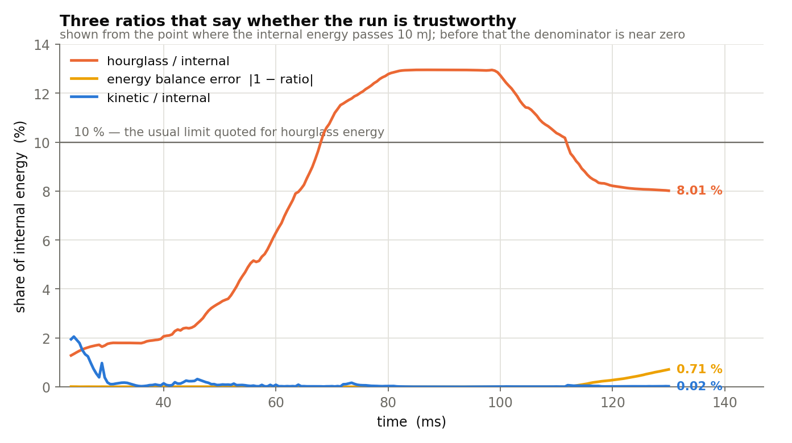
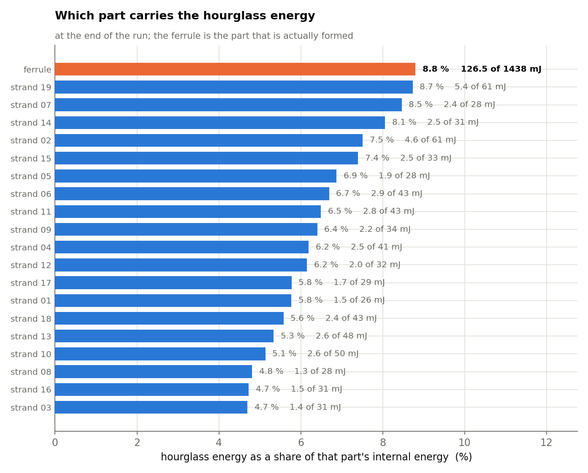

# LS-DYNA Crimping Simulation

Explicit LS-DYNA simulation of a crimped 19-strand copper conductor and ferrule.

The model was built in LS-DYNA from a published Abaqus crimp-forming example. The
work covered the forming process, the contact between strands, ferrule and
tooling, the plastic deformation, the time step, and the post-processing of force
and energy results.

<table><tr>
<td width="50%"></td>
<td width="50%"></td>
</tr></table>

Each frame carries the solver time, the punch stroke, the punch force and the
programmed feed rate, all taken from the files in this repository.

## At a glance

| | |
|---|---|
| Peak punch force | **6778 N** at 6.871 mm of a 6.88 mm stroke |
| Punch against anvil at peak load | 6778.2 N / 6815.9 N — **0.56 %** apart |
| Global energy balance at the end | **0.71 %** |
| Kinetic / internal energy during forming | **0.165 %** max, 0.022 % at the end |
| Deformable mesh against the reference | **67 375 elements, one for one** |
| Run | 481 482 cycles, 8 h 27 min on 4 SMP threads, normal termination |

## Reference model

The LS-DYNA model was reproduced independently from the Abaqus example *Crimp
forming with general contact* [1], which is based on the work of Villeneuve, Berry
and co-workers [2–4]. The reference supplied the geometry, the mesh of the
deformable parts, the material data and the loading history; the LS-DYNA
implementation is this repository's own work.

The deformable mesh carries over exactly: the reference defines 67 375 C3D8R
solids across the ferrule and the 19 strands, and the LS-DYNA deck has 67 375 hex
solids in the same 20 parts. The rigid tooling surfaces were remeshed finer for
LS-DYNA, 7472 shells against 934 in the reference, which gives the penalty contact
a smoother surface to work against.

Everything that defines the physics maps across directly:

| Reference (Abaqus) | LS-DYNA |
|---|---|
| `C3D8R`, reduced integration | `*SECTION_SOLID` ELFORM 1 |
| `*SECTION CONTROLS, HOURGLASS=STIFFNESS` | `*CONTROL_HOURGLASS` IHQ 6, QH 0.1 |
| `R3D4` rigid surfaces | rigid shells, ELFORM 2, `*MAT_RIGID` |
| `*Plastic` tables, both materials | `*MAT_PIECEWISE_LINEAR_PLASTICITY` + `*DEFINE_CURVE`, same points |
| `*Bulk Viscosity 0.06, 1.2` — linear 0.06, quadratic 1.2 | `*CONTROL_BULK_VISCOSITY` Q1 1.2, Q2 0.06 — Q1 is quadratic, Q2 linear |
| `*Friction 0.3 / 0.15`, `taumax=300` | contact FS 0.30 / 0.15, VC 300 |
| general contact, all element based, punch↔anvil excluded | 7 explicit interfaces |
| `*Amplitude`, SMOOTH STEP, five points to −6.88 | `*DEFINE_CURVE` PUNCH_STROKE, same points |
| `WIRES_END, PINNED` | `*BOUNDARY_SPC_SET`, strand ends in x, y, z |
| `_G85, ENCASTRE` | anvil `*MAT_RIGID` CON1 7, CON2 7 |
| `TOP_RIGID_REFNODE` free in DOF 2 only | punch CMO 1, CON1 6, CON2 7 |
| `*FIXED MASS SCALING, FACTOR=1.0E+6` | `*CONTROL_TIMESTEP` DT2MS −3.0e-7 |
| `*Dynamic, Explicit`, step to 0.122333 s | `*CONTROL_TERMINATION` 0.13 s, adding a dwell |

Mass scaling is part of the reference setup, not something introduced here. The
two solvers implement it differently, so the `DT2MS` value is not treated as
numerically equivalent to the Abaqus factor, and no attempt is made to reproduce
the Abaqus numbers exactly.

## The forming process

The reference drives the punch with a five-point SMOOTH STEP amplitude, which
gives four programmed segments before the stroke is complete:

| Segment | Stroke | Feed |
|---|---|---|
| 0 → 18 ms | 0 → 0.90 mm | 50 mm/s |
| 18 → 30.8 ms | 0.90 → 4.75 mm | 300 mm/s |
| 30.8 → 90.8 ms | 4.75 → 6.25 mm | 25 mm/s |
| 90.8 → 122.3 ms | 6.25 → 6.88 mm | 20 mm/s |
| 122.3 → 130 ms | held at 6.88 mm | dwell added in LS-DYNA |

The tabulated LS-DYNA curve reproduces that amplitude closely enough to be checked
against it: the fastest instantaneous punch speed in the run is 562.5 mm/s, which
is 1.875 × 300 mm/s — exactly the peak of a quintic smooth step over its mean. The
fast 300 mm/s segment ends at 4.75 mm, which is where the tooling first meets the
strand bundle, so the whole of the forming itself happens on the 25 and 20 mm/s
segments.



The force stays near zero over the first 4.6 mm, while the barrel wings bend with
little resistance. It rises to about 0.4 kN once the wings reach the strand bundle,
then climbs steeply over the last 0.6 mm as the strands are compacted into the
closing barrel, reaching 6778 N at 6.871 mm. During the 7.7 ms dwell the load comes
down to 5736 N as the compacted bundle settles.

Some local oscillations are visible in the force response during forming; they are
not interpreted individually here.

## Views

| | |
|---|---|
|  |  |
| **Wire end** — the 19 strands, each meshed as its own part. | **From above** — looking down onto the punch. |

Four LS-PrePost exports of the d3plot, cropped to the model with the background
flattened, and a caption bar and readout strip added. `crimp_front.gif` is a front
view along the conductor, with the tooling hidden so the ferrule and the 19 strands
stay visible; the other three are isometric at different rotations.

## Results

Every value below comes from `results/results.csv`, which `scripts/postprocess.py`
writes from the output files in `results/`.

| Quantity | Value |
|---|---:|
| Peak punch force | 6778.2 N |
| Time at peak force | 0.1186 s |
| Punch stroke at peak | 6.871 mm |
| Total punch stroke | 6.88 mm |
| Anvil reaction at peak | 6815.9 N |
| Punch / anvil difference | 0.56 % |
| Punch force at termination | 5736.4 N |
| Final internal energy | 2159.52 mJ |
| Final external work | 2900.63 mJ |
| Final sliding interface energy | 547.00 mJ |
| Final hourglass energy | 173.06 mJ |
| Final kinetic energy | 0.466 mJ |
| Final energy ratio | 0.992902 |
| Energy-balance error | 0.71 % |
| Maximum kinetic energy | 0.987 mJ |
| Maximum KE / IE during forming | 0.165 % |
| Final KE / IE | 0.022 % |
| Maximum HG / IE during forming | 12.95 % |
| Final HG / IE | 8.01 % |
| Ferrule HG / IE | 8.80 % |
| Strand HG / IE | 6.45 % |
| Final sliding / internal energy | 25.3 % |

"During forming" runs from the point where the internal energy passes 10 % of its
final value, at 61 ms. Earlier than that the internal energy is close to zero and a
ratio against it carries no information.

### Force equilibrium

At peak load the punch reaction is 6778.2 N and the anvil reaction is 6815.9 N, a
difference of 0.56 %. The two are summed over separate `rcforc` interfaces, so this
is an independent global equilibrium check on the forming setup rather than the
same number read twice.

### Energy balance

External work 2900.63 mJ, internal energy 2159.52 mJ, sliding interface energy
547.00 mJ, hourglass energy 173.06 mJ. The energy ratio holds at 1.0000 through the
whole closing ramp and ends at 0.992902, a balance error of 0.71 %. The small drift
appears only in the last 15 ms, at the highest load, where the contact penalty work
is largest.





### Quasi-static behaviour

The largest kinetic energy anywhere in the run is 0.987 mJ against 2159.52 mJ of
internal energy. During the forming window the kinetic-to-internal ratio stays at
or below 0.165 %, and it ends at 0.022 %. The calculation is therefore governed by
deformation energy rather than by inertia, and the forming is treated as
quasi-static on that basis. The feed rates support the same reading: forming runs at
25 and 20 mm/s, with the one fast segment confined to the approach travel.

### Contact and deformation

The deformed shape shows clean interaction between ferrule, strands and tooling,
with no visually evident tool penetration in the results presented here. Two things
in the solver output support that reading. The surface-to-surface interfaces run
with `IGNORE = 2`, which instructs LS-DYNA to warn about penetrating nodes at
initialisation, and no such warning was written. The run terminated normally, with
no negative volumes and no warnings in `d3hsp`. No penetration depth was extracted
from the d3plot, so this remains a qualitative check.

## Numerical behaviour

### Hourglass energy

Hourglass energy is reported because the solids use one-point integration, as in
the reference: `C3D8R` with `*SECTION CONTROLS, HOURGLASS=STIFFNESS` there,
ELFORM 1 with `*CONTROL_HOURGLASS` IHQ 6 and QH 0.1 here — the Belytschko-Bindeman
assumed-strain co-rotational stiffness form. With a stiffness-based form the
reported hourglass energy is work stored against the control stiffness that resists
the zero-energy modes of a single integration point. It enters the global energy
balance as a numerical stiffness contribution rather than as plastic work.

The ratio to internal energy reaches 12.95 % around 86 ms and settles at 8.01 %.
Both quantities grow through the run; the ratio falls because the internal energy
grows faster. From 86 ms to the end, hourglass energy goes from roughly 50 to
173 mJ, a factor of 3.4, while internal energy goes from 392 to 2160 mJ, a factor
of 5.5 — the second half of the stroke, where the strands are compacted, is
dominated by plastic work.

Split by part it is 8.80 % for the ferrule and 6.45 % for the strands, with the
ferrule carrying 127 of the 173 mJ. That is where the mechanics put it: the ferrule
is a thin wall going through large-rotation bending as the barrel wings fold, which
is exactly the deformation mode a single integration point cannot represent on its
own and which the hourglass stiffness has to carry. The strands deform mostly by
compaction and contact, which the same element handles with less hourglass work.



The quantity most sensitive to this is local stress and strain in the ferrule wall.
The global punch force is read from contact resultants, which is why it is
cross-checked against the anvil reaction separately. Bringing the hourglass
contribution down would mean more elements through the wall thickness, or a
selectively reduced or fully integrated formulation — a comparison worth running,
and one that would move away from the element and section controls the reference
itself specifies.

### Mass scaling

Explicit forming needs mass scaling to reach a workable time step, and the
reference does it too: `*FIXED MASS SCALING, FACTOR=1.0E+6` multiplies every
element mass by a million, which lifts the stable step by a factor of a thousand.

The LS-DYNA model works from the other end. `DT2MS = -3.0e-7` names the target step
and the solver adds only the mass each element needs to reach it; with TSSFAC 0.9
the step settles at 2.70e-7 s for all 481 482 cycles. The added mass is 3.8251e-4 t
against a physical model mass of 1.2412e-6 t, which the solver reports as a 308×
increase. That ratio is taken against the total model mass, and since the rigid
punch and anvil receive none of it, the parts actually scaled — ferrule and
strands, 1.51e-7 t — run at about 2500×. Set against the million-fold factor in the
reference, the LS-DYNA run carries some four hundred times less added mass.

The two implementations are different and the figures are not offered as
equivalent. What decides whether the scaling reached the answer is the inertial
content, and that is small, as above. A sensitivity run at a different target step
is the natural next check.

### Contact time step notice

At start-up LS-DYNA notes that the step should stay under about 3.26 ns to avoid
contact instabilities, against the 2.70e-7 s used. The interfaces concerned run
with `SOFT = 1`, which derives the penalty stiffness from the nodal masses and the
time step instead of from the material stiffness, so the notice is not read as an
indication of failure — nor as making the time step irrelevant. The run was checked
on force, energy and deformation, and it terminated normally.

## Model

| | |
|---|---|
| Solver | LS-DYNA SMP, double precision, R16.1 build 180, 4 threads |
| Units | mm, t, s → N, MPa, mJ |
| Mesh | 91 460 nodes; 67 375 hex solids (ferrule 4888, strands 62 487); 7472 rigid shells |
| Solids | ELFORM 1, `*CONTROL_HOURGLASS` IHQ 6, QH 0.1 |
| Tooling | punch and anvil as rigid shells, ELFORM 2, t 0.1 mm; punch free in y only, anvil fixed |
| Ferrule | `*MAT_PIECEWISE_LINEAR_PLASTICITY`, E 112 GPa, ν 0.34, σy 391 MPa, curve to 440 MPa at 1.7 % |
| Strands | same model, E 117 GPa, ν 0.35, σy 241.5 MPa, curve to 290.3 MPa at 1.7 % |
| Time step | TSSFAC 0.9, DT2MS −3.0e-7 → 2.70e-7 s |
| Accuracy | OSU 1, INN 4; bulk viscosity Q1 1.2 quadratic, Q2 0.06 linear |
| Load | `*BOUNDARY_PRESCRIBED_MOTION_RIGID`, punch in y, displacement curve to 6.88 mm |

Both flow curves are the reference tables, point for point, and both end at a
plastic strain of 20 — 4270 MPa for the ferrule, 4100 MPa for the copper. Between
1.7 % and that last point the curve is a straight line, so hardening through the
forming range follows the reference definition rather than measured data.

**Contacts** — seven interfaces standing in for the reference's general contact,
with `FD = DC = 0` so µ stays at the static value:

| ID | Interface | Type | µ |
|---|---|---|---|
| 1, 2 | ferrule → anvil, punch | `AUTOMATIC_SURFACE_TO_SURFACE_MPP`, SOFT 1 | 0.30, 0.15 |
| 3, 4 | strand ↔ strand, ferrule ↔ ferrule | `AUTOMATIC_GENERAL` | 0.15, 0.30 |
| 5, 6, 7 | strands → ferrule, punch, anvil | `AUTOMATIC_SURFACE_TO_SURFACE_MPP`, SOFT 1 | 0.15 |

The friction values and the 300 MPa shear cap come straight from the reference's
interaction properties. Interface 3, the strand-to-strand self contact, is 21 % of
the run time on its own — the price of meshing all 19 strands separately and
letting them pack against each other. Interface 7 records zero load throughout: the
ferrule stays between the strands and the anvil for the whole stroke.

## Scope and next steps

What the model covers, and what it deliberately leaves for a later stage:

* The flow curves follow the reference tables, whose last point sits at a plastic
  strain of 20. Hardening through the forming range is the reference definition,
  interpolated, rather than measured material data.
* No strain-rate dependence and no damage or failure model, matching the reference.
* Strand ends are constrained in x, y and z, as in the reference (`WIRES_END,
  PINNED`). The model therefore addresses transverse crimping rather than conductor
  pull-out or axial material flow.
* The calculation ends at the final forming stroke, so springback is not evaluated.
  A separate unloading step would give elastic recovery and residual deformation.
* Electrical resistance, impedance and RF behaviour are outside the scope of a
  mechanical forming model.
* Useful further work, in order: a mesh and element-formulation study on the
  ferrule wall, a mass-scaling sensitivity run, an unloading step, and correlation
  against measured crimp force if data becomes available.

The reference is a published numerical example, so it is the basis for the model
rather than experimental validation.

## Repository

```
model/crimp_forming.k     the deck, as run
results/                  glstat, rcforc, matsum, sleout, lsrun.out, results.csv
results/figures/          4 figures
results/animations/       4 views
scripts/postprocess.py    writes results.csv and the figures from results/
```

`scripts/postprocess.py` reads `glstat`, `rcforc`, `matsum` and `sleout` together
with the punch stroke curve in the deck, and writes `results/results.csv` and the
four figures. It needs only `matplotlib`.

```bash
ls-dyna_smp_d i=model/crimp_forming.k ncpu=4   # about 8.5 h on four threads
python3 scripts/postprocess.py
```

`d3plot` and `d3hsp` are not in the repository, about 500 MB together. The machine
name and input path were removed from `lsrun.out`.

## Conclusion

The model carries the reference crimp-forming setup through to a full 6.88 mm punch
stroke in one stable run. Peak punch force is 6778 N, the punch and anvil reactions
agree to 0.56 % at peak load, the global energy balance closes to 0.71 %, and the
kinetic content stays at 0.165 % of internal energy or below through forming. The
deformable mesh, the material data, the friction properties, the boundary conditions
and the punch amplitude all correspond to the reference, and the punch velocity
profile matches the reference's smooth-step amplitude to its analytical peak.

The open items are the ones listed above — a mesh and element-formulation study on
the ferrule wall, a mass-scaling sensitivity run, an unloading step for springback,
and experimental correlation.

The purpose of the work was to build the crimping process in LS-DYNA, understand how
it behaves, and set up a repeatable way of checking the numerical results.

## References

[1] Dassault Systèmes, *Abaqus Example Problems Guide*, Section 2.1.10, "Crimp
forming with general contact", Abaqus/Explicit, 2016. The example cites:

[2] G. Villeneuve, D. Kulkarni, P. Bastnagel, D. Berry, "Dynamic Finite Element
Analysis Simulation of the Terminal Crimping Process," *42nd IEEE Holm Conference*,
Chicago, IL, October 1996.

[3] G. Villeneuve, P. Bastnagel, D. Berry, C. S. Nagaraj, "Determining the Factors
Affecting Crimp Formation Using Dynamic Finite Element Analysis," *30th IICIT
Connector and Interconnection Symposium*, Anaheim, CA, September 1997.

[4] D. T. Berry, "Development of a Crimp Forming Simulator," *ABAQUS User's
Conference Proceedings*, pp. 125–137, 1998.
